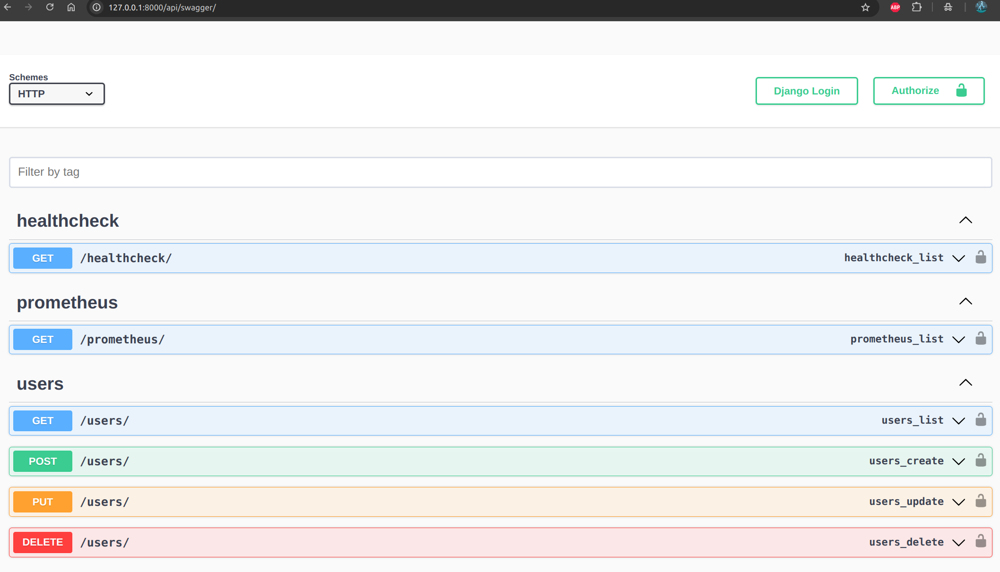

# devops-lifecycle
This project showcases the differents steps of the DevOps lifecycle of a simple app:

-API Code: Python (Django), sqlite

-Test: Python (django.test.testcase, unittest)

-Continuous integration: Github actions

-Continuous deployment: Github actions + Render

-Infrastructure as code: Vangrant, Ansible

-Contenerisation: Docker, Docker Compose

-Container orchestration: Kubernetes

-Service mesh: Istio

-Monitoring: Prometheus, Grafana

## Installations
##### Python >= 3.10
Install a python version greater or equal to 3.10: https://www.python.org/downloads/
Install a python environment manager, like virtualenv for exemple: https://virtualenv.pypa.io/en/latest/installation.html  

##### Vagrant
Install Vagrant: https://developer.hashicorp.com/vagrant/install

##### Virtualbox
Install virtual box: https://www.virtualbox.org/wiki/Downloads

##### Ansible
Install Ansible: https://docs.ansible.com/ansible/latest/installation_guide/intro_installation.html

##### Minikube
Install Minikube: https://minikube.sigs.k8s.io/docs/start/?arch=%2Flinux%2Fx86-64%2Fstable%2Fbinary+download

##### Docker
Install Docker: https://docs.docker.com/engine/install/


## Run the API
Create a python virtual environment
```bash
python3.10 -m venv myenv
```
Activate the created environment
```bash
cd myenv
source ./myenv/bin/activate
```
Install the requirements
```bash
cd userapi
pip install -r requirements.txt
```

Create and migrate the database
```bash
python3 manage.py makemigrations
python3 manage.py migrate
```

Run the API
```bash
python3 manage.py runserver
```
Access the swagger UI through your browser at http://127.0.0.1:8000/api/swagger/



Get the list of users, Add, Update and delete users thought the differents endpoints.
