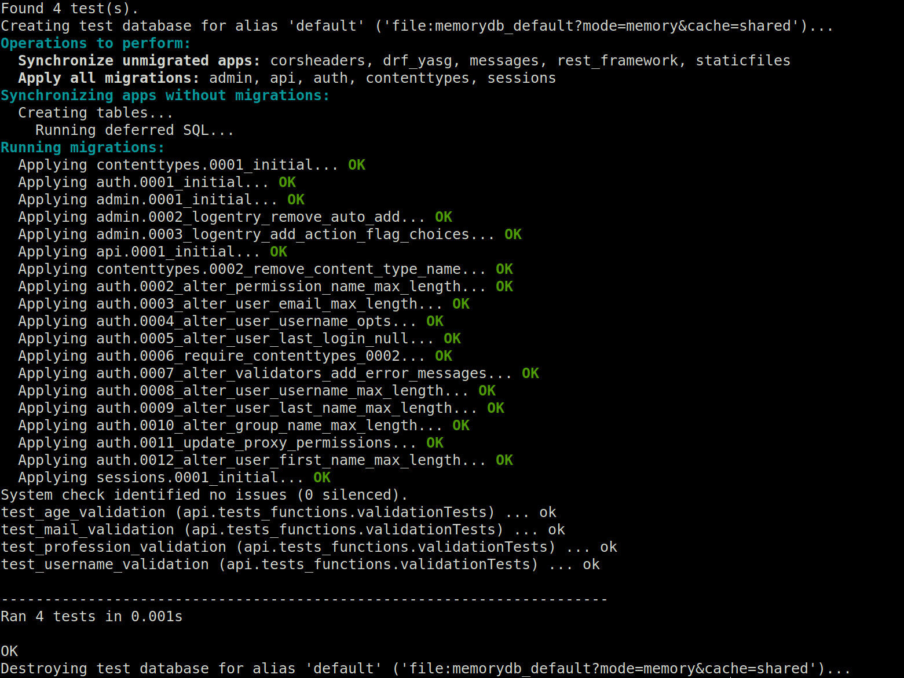
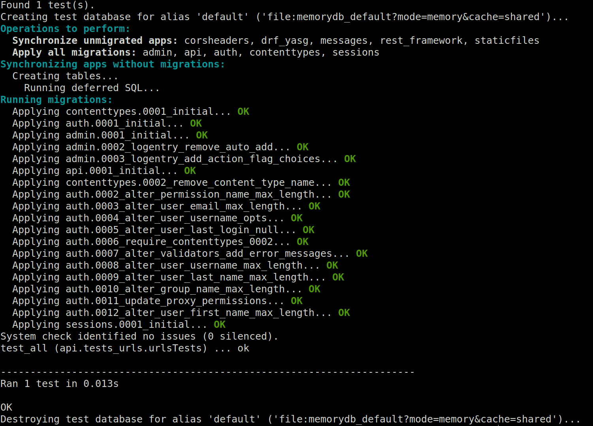
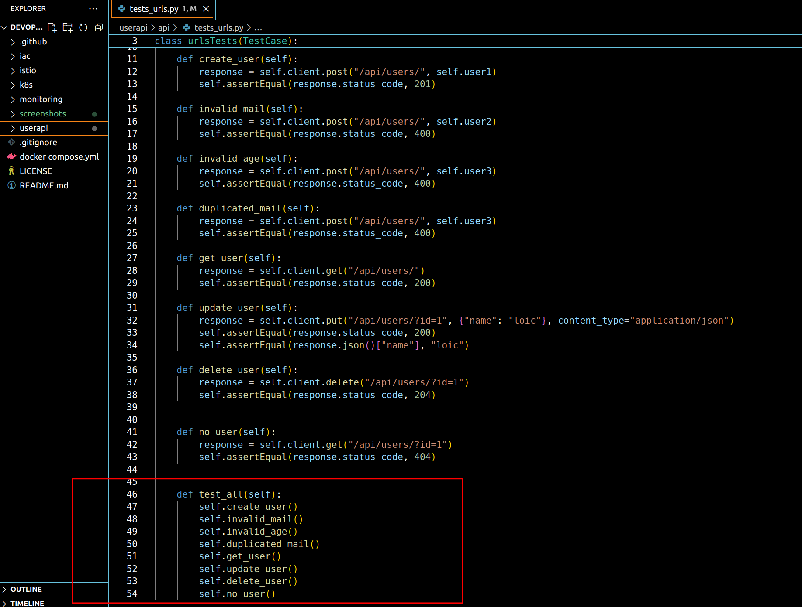
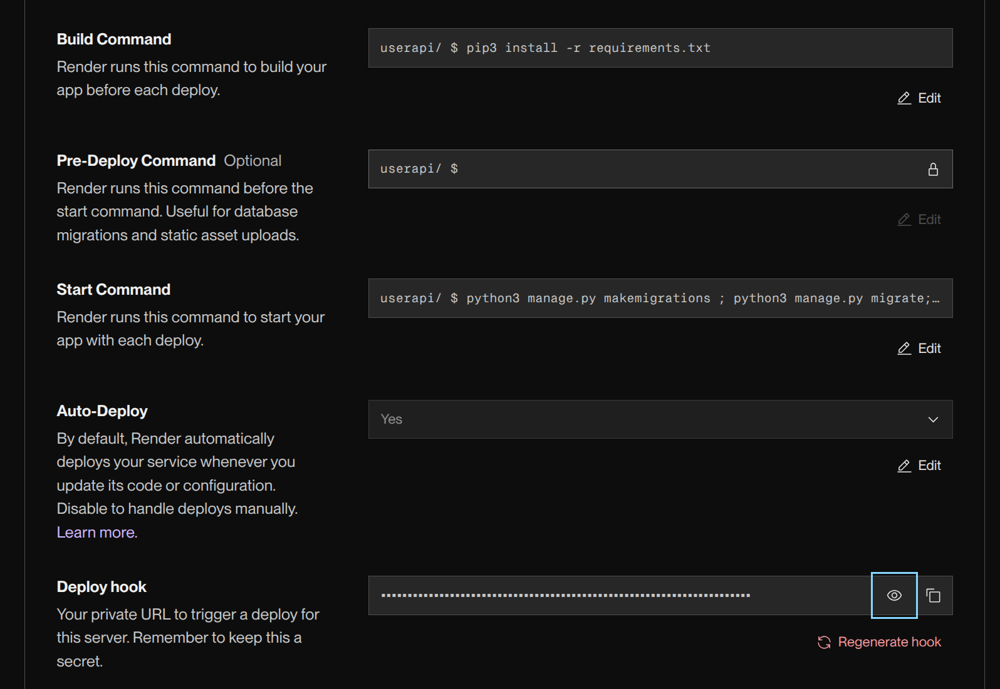
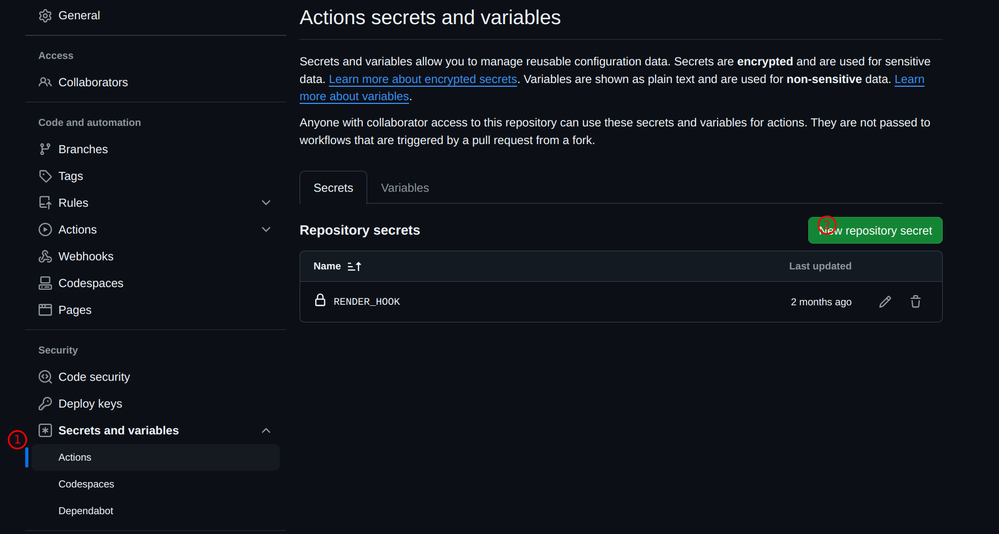

# devops-lifecycle
This project showcases the differents steps of the DevOps lifecycle of a simple app:

-API Code: Python (Django), sqlite

-Test: Python (django.test.testcase)

-Continuous integration: Github actions

-Continuous deployment: Github actions + Render

-Infrastructure as code: Vangrant, Ansible

-Contenerisation: Docker, Docker Compose

-Container orchestration: Kubernetes

-Service mesh: Istio

-Monitoring: Prometheus, Grafana

## Installations
##### Python >= 3.10
Install a python version greater or equal to 3.10: https://www.python.org/downloads/
Install a python environment manager, like virtualenv for exemple: https://virtualenv.pypa.io/en/latest/installation.html  

##### Vagrant
Install Vagrant: https://developer.hashicorp.com/vagrant/install

##### Virtualbox
Install virtual box: https://www.virtualbox.org/wiki/Downloads

##### Ansible
Install Ansible: https://docs.ansible.com/ansible/latest/installation_guide/intro_installation.html

##### Minikube
Install Minikube: https://minikube.sigs.k8s.io/docs/start/?arch=%2Flinux%2Fx86-64%2Fstable%2Fbinary+download

##### Docker
Install Docker: https://docs.docker.com/engine/install/


## Running the API
Create a python virtual environment
```bash
python3.10 -m venv myenv
```
Activate the created environment
```bash
cd myenv
source ./myenv/bin/activate
```
Install the requirements
```bash
cd userapi
pip install -r requirements.txt
```

Create and migrate the database
```bash
python3 manage.py makemigrations
python3 manage.py migrate
```

Run the API
```bash
python3 manage.py runserver
```
Access the swagger UI through your browser at http://127.0.0.1:8000/api/swagger/


Get the list of users, Add, Update users informations and delete users thought the differents endpoints.


## Running unittests on enpoints and functions

The folder userapi/api contains two files for testing:
-tests_functions.py: to test critical fonctions
-tests_urls.py: to test the endpoints that are meant to be used by the user

Launch the functions test by executing:
```bash
cd userapi
python3 manage.py test -v2 api.tests_functions
```
"-v2" is for a detailled output


Launch the endpoints test by executing:
```bash
cd userapi
python3 manage.py test -v2 api.tests_urls
```

Here we run all the url tests in one test because we want them to be run in a certain order:


## CI/CD
The file django_CI_CD.yml in the .github include the instructions to build the project and run the tests all the tests, then, if everything is working well, the project will be deployed.

For the deployment, we used [render](https://render.com), a platform allowing to deploy easily the content of a github repository.
After linking your repository, you need to provide the build, start commands and to generate a deploy_hook. It is an url that will trigger the deployment of your app.


Instead of hard coding the deploy_hook in your github action file, create an action secret in your settings, set it to the value of the deploy_hook, and use the secret name.

exemple with github

